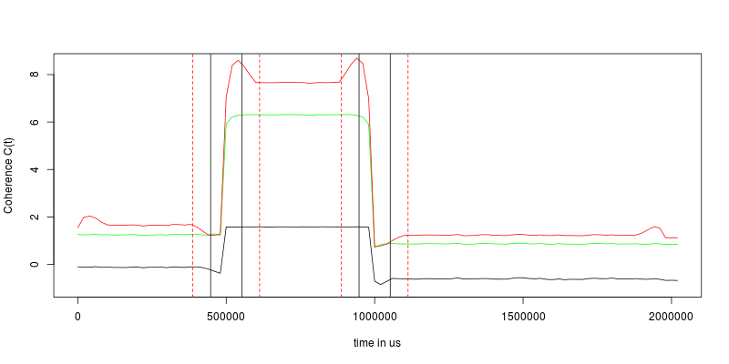
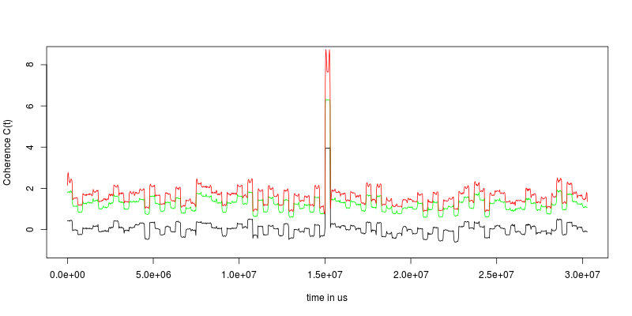
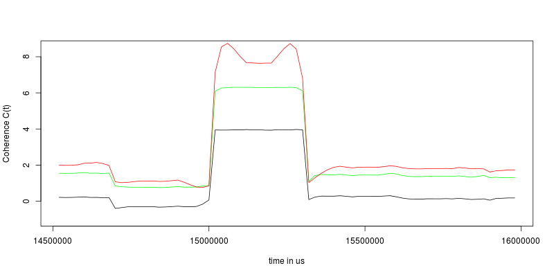

==============
Benchmark Data
==============

In order to show artifacts and the results of misconceptions in the
xyt-grid approach we conduct several situations and generate data for it.

Randomness and other Parameter
==============================
Whenever a random location at the screen is selected, it was selected from
a normal distribution with a standard deviation of one sixth of the screen
width respectively height and a mean of the center of the screen.

To every single data point some noise was added to the x and y coordinates.
The noise was sampled from a normal distribution with zero mean and a
standard deviation of 5 pixels. This will be referred as noise.

The screen resolution was set to 1280 pixels times 720 pixels.

The sampling rate in time was chosen to be 50 Hz.

Some situations will be simulated with and without noise.

Situations
==========

Random-Coherent-Random
----------------------
1. Twenty subjects fixate for 500 ms *twenty different* locations at the
   screen.
2. The twenty subjects switch simultaneously to *one* random location at
   the screen and fixate this location for 500 ms.
3. The subjects switch to *twenty new and different* locations at the
   screen and fixate them for another 1000 ms.

Random-Coherent-Random shows artifacts that occur on the change between a
coherent event and a non-coherent event. It is not suitable for an estimate of
the synchronicity or coherence value for the coherent event because the
marginal population distribution is highly influenced by the coherent event.
See :ref:`alt_marginal_distribution` for more details.

Sequence-of-Random-Intervalls
-----------------------------
Twenty subjects fixate for 300 ms twenty different locations at the screen.
Every 300 ms all twenty subjects switch to twenty new locations.

Sequence-of-Random-Intervalls provides a benchmark for the distribution of zero
coherence data.

Find-the-Needle
---------------
Twenty subjects fixate for 300 ms twenty different locations at the screen.
Every 300 ms all twenty subjects switch to twenty new locations.

There are fifty intervals with zero coherence. After that one
coherent interval as described in Random-Coherent-Random follows. And then
another fifty intervals with zero coherence are attached.

Find-the-Needle provides a benchmark for a coherent event within random
data. The algorithm should yield a significant coherence value for the
coherent event.

Two-Groups
----------
Twenty subjects fixate for 300 ms twenty different locations at the screen.
After 300 ms :math:`n` subjects switch one new locations and :math:`20 - n`
switch to another new location.

Group-and-Random
----------------
After a 300 ms random interval :math:`n < 20` subjects switch to one new
location and the remaining :math:`20 - n` subjects switch to a new random
location each.

Accumulation
------------
After a 300 ms random interval for each 300 ms interval an additional
subject switches to one specific location. After 20 intervals all subjects
are at this specific location.

