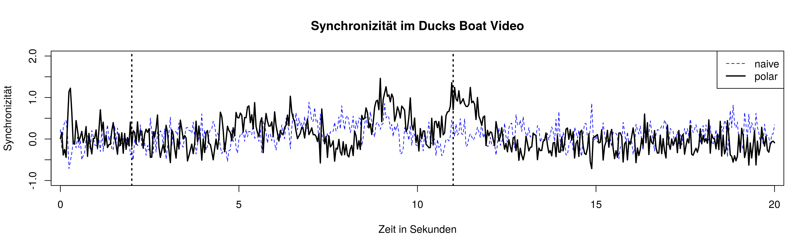

=============
Visualisation
=============

Three categories of visualisations are helpful. First, plots and animations
that show the results and give an intuitive understanding. Second,
diagnostic plots that help decide if certain assumptions are fulfilled and
wich shows the limitations of the procedure. And third, animations and
plots that help understand what the algorithm does and how he achieves to
come up with one synchronicity or coherence value.

Visualizing Results
===================

Alpha-Overlay of NSS-Maps
-------------------------
Animation of the video with a black alpha channel overlay where high alpha
values correspond to high positive coherence saliency values. And an alpha
value of zero corresponds to a negative or zero saliency value.

Additionally gaze points can be added as little dots or crosses and the
coherence value can be added as a number representation to the top right
corner.

This visualisation only works for coherence.

Time-Synchronicity-Plot
-----------------------
Plotting the synchronicity against time seems straight forward. But because the
synchronicity values are standard normal distributed it might be a good idea to
apply an inverse normal transform to come up with an equidistant measure. On
the other hand a value greater than e. g. two does not mean, that this value is
more than two standard deviations away from the expected value of zero under
the null hypothesis for random gazes.

Therefore we recommend a time-synchronicity plot (without transforming) to get
a good clue which parts of the video have gazes in high synchrony, but use an
inverse normal transform, if you want to do more calculations e. g. time series
analysis on the data.

This also works for coherence values.

Diagnostic Plots
================

Marginal spatial distribution plot
----------------------------------
Heat map of the marginal spatial distribution for the population. Is this
heat map a good approximation for a random gaze pattern? Check for highly
inhomogeneous regions or small regions that dominate the heat map and
therefore the distribution. The heat map should look smooth and there
shouldn't be single distinguishable regions.

Demonstrations
==============
In order to come up with the right interpretations and the right
applications for a method it is crucial to get a good understanding what
happens behind the scenes.

Gaussian spatio temporal distribution
-------------------------------------
3D animation or plot of one and several Gaussian spatio temporal
distributions in order to get the understanding of how the discrete gaze
point is smoothen in space and time.

Fixation Map
------------
Animation how the superposition of several Gaussian distributions results
in the fixation map. Showing this for different numbers of subjects and
motivating the necessity of a normalization step.

Normalization
-------------
Show the differences between xy-grid normalization and population
normalization. Show how the normalization results in comparable results for
different fixation maps.

Rotation estimation
-------------------
Animate a leave-one-out estimation for a specific point in time.

Missing Data
------------
Reasons for systematic and unsystematic missing data in gaze data. How deal
this procedure with missing data.

